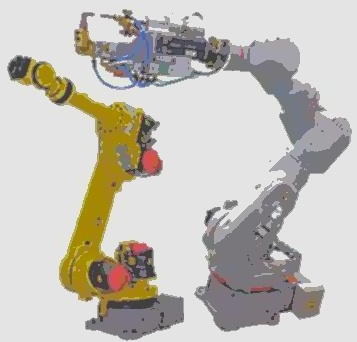

# Image processing modular blocks (IMB)

This project aims at providing a minimalist, yet expandible, image processing framework. With modular blocks of image processing steps the goal is to reach pipeline flexibility and expose used algorithms for further adjustments and performance optimization. This is of particular interest for embedded applications and for use with other frameworks that heavily rely on computer vision, such as ROS.

### Example

| Input | Output |
|:-----:|:------:|
|  |  |
|  |  |
|  |  |

## Flowchart


## Dependencies

* Build essentials
* Git (to pull this source)
* CMake >= 2.8.3
* OpenCV >= 3.2.0

### Ubuntu/Debian

```
# apt install build-essential git cmake libopencv-dev
```

## Download

Get the source code:

```
$ git clone https://github.com/em-er-es/imb
```

For building packages use the overlay repository and follow the instructions:

```
$ git clone https://github.com/em-er-es/devops
```

## Installation

### Using Docker generated packages

```
# dpkg -i imb-*.deb
```

### From local build

Set the prefix for local installation in accordance with FHS:

```
$ cd build
$ cmake .. -DCMAKE_INSTALL_PREFIX="$HOME/.local"
$ make install
```

## Building

### Automated build

Use the included script from this (base) directory:

```
$ bash scripts/build.sh
```

### Manual configuration, build and installation

```
$ mkdir -p build && cd build
$ cmake .. -DCMAKE_BUILD_TYPE=Debug -DCMAKE_C_COMPILER=/usr/bin/gcc -DCMAKE_CXX_COMPILER=/usr/bin/g++ -DCMAKE_INSTALL_PREFIX="$HOME/.local" -DDEBUG=0 -DCOVERAGE=0 -DPROFILE=0 -DVERBOSE=0
$ make -j $(nproc)
$ make install
```

LLVM can be used as well, as per `build.sh`, however certain builds result in segmentation fault. Thorough testing is recommended.

## Packaging

Check the devops repository: [https://github.com/em-er-es/devops](https://github.com/em-er-es/devops)

## Running

### Local source build

```
$ build/bin/imb -i input/input.png -o output/output.png -d
```

### Packaged build

```
$ imb -i input/input.png -o output/output.png -d
```

## Usage

```
Usage: build/bin/imb [-acCdDhmrRv] -i input -o output
	-a	Scan lines
	-c	Color mixing
	-C	Continuous image check
	-d/D	Enable/Disable input and output comparison display
	-h	This help
	-i	Input image (default: input.png)
	-m	VIC II model selector (default: latest)
	-o	Output image (default: output.png)
	-r/R	Enable/Disable RGB comparison (default: enabled)
	-v	Verbose
```
